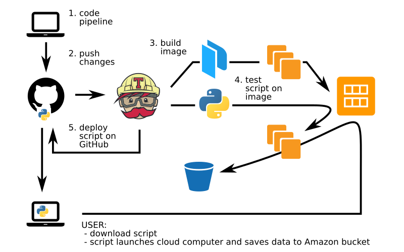

# virus-inclusive single cell RNA-Seq @ CZ BioHub
Sequencing transcriptomes and viruses from infected cells.

This repo consists of three parts:
- `build` contains instructions to set up an Amazon EC2 AMI with all the software required to process reads into count tables. This part is reserved for development and should ideally only be run by a CI worker in the cloud.
- `test` contains instructions to test the AMI. This folder is also for development.
- `run` contains a command-line program that instantiates one such AMI to run the processing pipeline on a specific dataset. This part is released as part of CD for users to download. However, the script from the vanilla repo won't work, please look at a _realeased_ version.

Here's a schematic representation of the repo:

